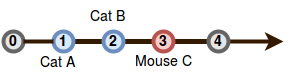
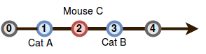

[Source](https://www.hackerrank.com/challenges/cats-and-a-mouse)
# Problem statement
Two cats and a mouse are at various positions on a line.  You will be given their starting positions.  Your task is to determine which cat will reach the mouse first, assuming the mouse doesn't move and the cats travel at equal speed.  If the cats arrive at the same time, the mouse will be allowed to move and it will escape while they fight.

You are given  queries in the form of , , and  representing the respective positions for cats  and , and for mouse . Complete the function  to return the appropriate answer to each query, which will be printed on a new line.


* If cat  catches the mouse first, print ```Cat A```.
* If cat  catches the mouse first, print ```Cat B```.
* If both cats reach the mouse at the same time, print ```Mouse C``` as the two cats fight and mouse escapes.  
For example, cat  is at position  and cat  is at .  If mouse  is at position , it is  units from cat  and  unit from cat .  Cat  will catch the mouse.  


**Function Description**  

Complete the catAndMouse function in the editor below.  It should return one of the three strings as described.  

catAndMouse has the following parameter(s):  


* x: an integer, Cat 's position  
* y: an integer, Cat 's position  
* z: an integer, Mouse 's position  

**Input Format**

The first line contains a single integer, , denoting the number of queries. 


Each of the  subsequent lines contains three space-separated integers describing the respective values of  (cat 's location),  (cat 's location), and  (mouse 's location).


**Constraints**


*   
*   

**Output Format**

For each query, return ```Cat A``` if cat  catches the mouse first, ```Cat B``` if cat  catches the mouse first, or ```Mouse C``` if the mouse escapes.


**Sample Input 0**

```
2
1 2 3
1 3 2
```

**Sample Output 0**

```
Cat B
Mouse C
```

**Explanation 0**

Query 0: The positions of the cats and mouse are shown below:


Cat  will catch the mouse first, so we print ```Cat B``` on a new line.

Query 1: In this query, cats  and  reach mouse  at the exact same time:


Because the mouse escapes, we print ```Mouse C``` on a new line.

