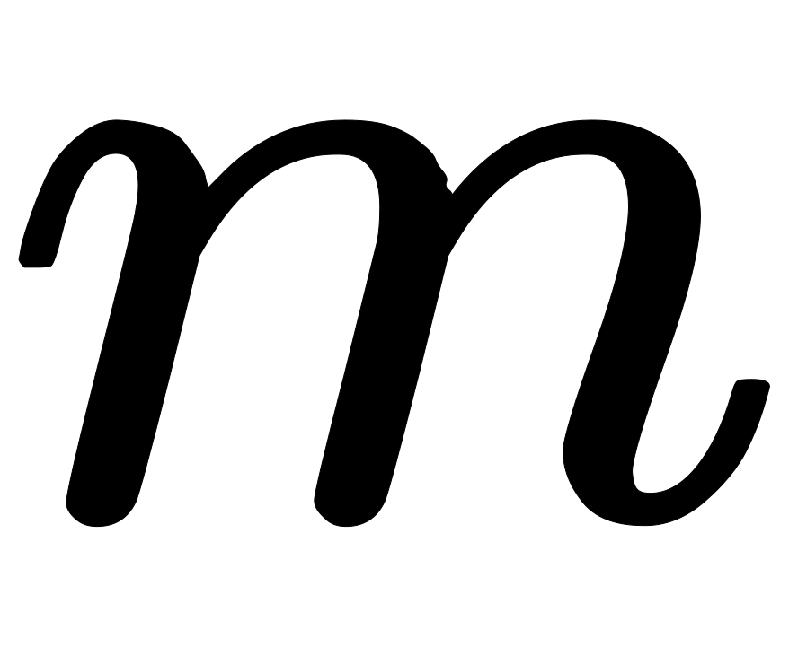

[Source](https://www.hackerrank.com/challenges/circular-array-rotation)
# Problem statement
John Watson knows of an operation called a right circular rotation on an array of integers.  One rotation operation moves the last array element to the first position and shifts all remaining elements right one.  To test Sherlock's abilities, Watson provides Sherlock with an array of integers.  Sherlock is to perform the rotation operation a number of times then determine the value of the element at a given position.

For each array, perform a number of right circular rotations and return the value of the element at a given index.

For example, array , number of rotations,  and indices to check, . 


First we perform the two rotations: 


 


Now return the values from the zero-based indices  and  as indicated in the  array. 


 


  


**Function Description**  

Complete the circularArrayRotation function in the editor below.  It should return an array of integers representing the values at the specified indices.  

circularArrayRotation has the following parameter(s):  


* a: an array of integers to rotate  
* k: an integer, the rotation count  
* queries: an array of integers, the indices to report  

**Input Format**

The first line contains  space-separated integers, , , and , the number of elements in the integer array, the rotation count and the number of queries. 


The second line contains  space-separated integers, where each integer  describes array element  (where ). 


Each of the  subsequent lines contains a single integer denoting , the index of the element to return from .


**Constraints**


* 
* 
* 
*     
* 

**Output Format**

For each query, print the value of the element at index  of the rotated array on a new line.


**Sample Input 0**

```
3 2 3
1 2 3
0
1
2
```

**Sample Output 0**

```
2
3
1
```

**Explanation 0**

After the first rotation, the array becomes . 


After the second (and final) rotation, the array becomes .   

Let's refer to the array's final state as array . For each query, we just have to print the value of  on a new line:


1. , .        
2. , .        
3. , .        
