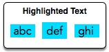

[Source](https://www.hackerrank.com/challenges/designer-pdf-viewer)
# Problem statement
When you select a contiguous block of text in a PDF viewer, the selection is highlighted with a blue rectangle. In this PDF viewer, each word is highlighted independently. For example: 



In this challenge, you will be given a list of letter heights in the alphabet and a string.  Using the letter heights given, determine the area of the rectangle highlight in  assuming all letters are  wide.  

For example, the highlighted .  Assume the heights of the letters are  and .  The tallest letter is  high and there are  letters.  The hightlighted area will be  so the answer is .  


**Function Description**  

Complete the designerPdfViewer function in the editor below.  It should return an integer representing the size of the highlighted area.  

designerPdfViewer has the following parameter(s):


* h: an array of integers representing the heights of each letter  
* word: a string  

**Input Format**

The first line contains  space-separated integers describing the respective heights of each consecutive lowercase English letter, ascii[a-z]. 


The second line contains a single word, consisting of lowercase English alphabetic letters.


**Constraints**


* , where  is an English lowercase letter.
*  contains no more than  letters.   

**Output Format**

Print a single integer denoting the area in  of highlighted rectangle when the given word is selected. Do not print units of measure.


**Sample Input 0**

```
1 3 1 3 1 4 1 3 2 5 5 5 5 5 5 5 5 5 5 5 5 5 5 5 5 5
abc
```

**Sample Output 0**

```
9
```

**Explanation 0**

We are highlighting the word ```abc```:

Letter heights are ,  and . The tallest letter, ```b```, is  high. The selection area for this word is .


**Note:** Recall that the width of each character is .


**Sample Input 1**

```
1 3 1 3 1 4 1 3 2 5 5 5 5 5 5 5 5 5 5 5 5 5 5 5 5 7
zaba
```

**Sample Output 1**

```
28
```

**Explanation 1**

The tallest letter in  is  at . The selection area for this word is .

