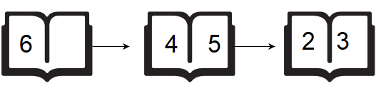
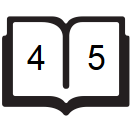

[Source](https://www.hackerrank.com/challenges/drawing-book)
# Problem statement
Brie’s Drawing teacher asks her class to open their books to a page number. Brie can either start turning pages from the front of the book or from the back of the book. She always turns pages one at a time.  When she opens the book, page  is always on the right side:


When she flips page , she sees pages  and .  Each page except the last page will always be printed on both sides.  The last page may only be printed on the front, given the length of the book.  If the book is  pages long, and she wants to turn to page , what is the minimum number of pages she will turn?  She can start at the beginning or the end of the book. 

Given  and , find and print the minimum number of pages Brie must turn in order to arrive at page . 


**Function Description**  

Complete the pageCount function in the editor below.  It should return the minimum number of pages Brie must turn.  

pageCount has the following parameter(s):  


* n: the number of pages in the book   
* p: the page number to turn to  

**Input Format**

The first line contains an integer , the number of pages in the book. 


The second line contains an integer, , the page that Brie's teacher wants her to turn to.


**Constraints**


* 
* 

**Output Format**

Print an integer denoting the minimum number of pages Brie must turn to get to page .  


**Sample Input 0**

```
6
2
```

**Sample Output 0**

```
1
```

**Explanation 0**

If Brie starts turning from page , she only needs to turn  page:


If Brie starts turning from page , she needs to turn  pages:



Because we want to print the minumum number of page turns, we print  as our answer.


**Sample Input 1**

```
5
4
```

**Sample Output 1**

```
0
```

**Explanation 1**

If Brie starts turning from page , she needs to turn  pages:


If Brie starts turning from page , she doesn't need to turn any pages:



Because we want to print the minimum number of page turns, we print  as our answer.

