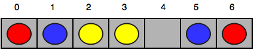
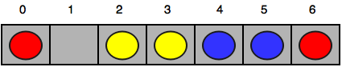
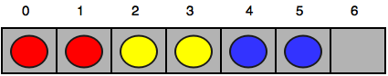

[Source](https://www.hackerrank.com/challenges/happy-ladybugs)
# Problem statement
Happy Ladybugs is a board game having the following properties:


* The board is represented by a string, , of length . The  character of the string, , denotes the  cell of the board.


    * If  is an underscore (i.e., ```_```), it means the  cell of the board is empty.
    * If  is an uppercase English alphabetic letter (ascii[A-Z]), it means the  cell contains a ladybug of color .
    * String  will not contain any other characters.


* A ladybug is happy only when its left or right adjacent cell (i.e., ) is occupied by another ladybug having the same color.
* In a single move, you can move a ladybug from its current position to any empty cell. 


Given the values of  and  for  games of Happy Ladybugs, determine if it's possible to make all the ladybugs happy. For each game, print ```YES``` on a new line if all the ladybugs can be made happy through some number of moves.  Otherwise, print ```NO```. 


As an example, .  You can move the rightmost  and  to make  and all the ladybugs are happy.  


**Function Description**

Complete the happyLadybugs function in the editor below.  It should return an array of strings, either 'YES' or 'NO', one for each test string.  

happyLadybugs has the following parameters:


* b: an array of strings that represents the initial positions and colors of the ladybugs  


**Input Format**


The first line contains an integer , the number of games.  

The next  pairs of lines are in the following format:  


* The first line contains an integer , the number of cells on the board.  
* The second line contains a string  describing the  cells of the board.  


**Constraints**


* 
* 


**Output Format**


For each game, print ```YES``` on a new line if it is possible to make all the ladybugs happy.  Otherwise, print ```NO```.


**Sample Input 0**


```
4
7
RBY_YBR
6
X_Y__X
2
__
6
B_RRBR
```


**Sample Output 0**


```
YES
NO
YES
YES
```


**Explanation 0**


The four games of Happy Ladybugs are explained below:


1. Initial board:  
  
After the first move:  
  
After the second move:  
  
After the third move:  
  
Now all the ladybugs are happy, so we print ```YES``` on a new line.

2. There is no way to make the ladybug having color ```Y``` happy, so we print ```NO``` on a new line.
3. There are no unhappy ladybugs, so we print ```YES``` on a new line.
4. Move the rightmost  and  to form .


**Sample Input 1**


```
5
5
AABBC
7
AABBC_C
1
_
10
DD__FQ_QQF
6
AABCBC
```


**Sample Output 1**


```
NO
YES
YES
YES
NO
```