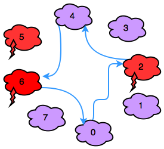

[Source](https://www.hackerrank.com/challenges/jumping-on-the-clouds-revisited)
# Problem statement
Aerith is playing a cloud hopping game. In this game, there are sequentially numbered clouds that can be thunderheads or cumulus clouds.  Her character must jump from cloud to cloud until it reaches the start again.  

To play, Aerith is given an array of clouds,  and an energy level . She starts from  and uses  unit of energy to make a jump of size  to cloud . If Aerith lands on a thundercloud, , her energy () decreases by  additional units. The game ends when Aerith lands back on cloud .

Given the values of , , and the configuration of the clouds as an array , can you determine the final value of  after the game ends?

For example, give  and , the indices of her path are .  Her energy level reduces by  for each jump to .  She landed on one thunderhead at an additional cost of  energy units.  Her final energy level is .


**Note:** Recall that  refers to the [modulo operation](https://en.wikipedia.org/wiki/Modulo_operation).  In this case, it serves to make the route circular.  If Aerith is at  and jumps , she will arrive at .  


**Function Description**  

Complete the jumpingOnClouds function in the editor below.  It should return an integer representing the energy level remaining after the game.  

jumpingOnClouds has the following parameter(s):  


* c: an array of integers representing cloud types  
* k: an integer representing the length of one jump  

**Input Format**

The first line contains two space-separated integers,  and , the number of clouds and the jump distance. 


The second line contains  space-separated integers  where . Each cloud is described as follows:


* If , then cloud  is a cumulus cloud.
* If , then cloud  is a thunderhead.

**Constraints**


*  
* 
* 
* 

**Output Format**

Print the final value of  on a new line.


**Sample Input**

```
8 2
0 0 1 0 0 1 1 0
```

**Sample Output**

```
92
```

**Explanation**

In the diagram below, red clouds are thunderheads and purple clouds are cumulus clouds:



Observe that our thunderheads are the clouds numbered , , and . Aerith makes the following sequence of moves:


1. Move: , Energy: .
2. Move: , Energy: .
3. Move: , Energy: .
4. Move: , Energy: .
