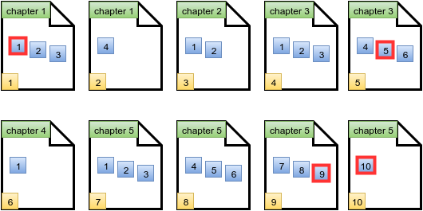

[Source](https://www.hackerrank.com/challenges/lisa-workbook)
# Problem statement
Lisa just got a new math workbook.  A workbook contains exercise problems, grouped into chapters.  Lisa believes a problem to be special if its index (within a chapter) is the same as the page number where it's located.  The format of Lisa's book is as follows:


* There are  chapters in Lisa's workbook, numbered from  to .
* The  chapter has  problems, numbered from  to .
* Each page can hold up to problems. Only a chapter's last page of exercises may contain fewer than  problems.
* Each new chapter starts on a new page, so a page will never contain problems from more than one chapter.
* The page number indexing starts at .

Given the details for Lisa's workbook, can you count its number of special problems?

For example, Lisa's workbook contains  problems for chapter , and  problems for chapter .  Each page can hold  problems.  The first page will hold  problems for chapter .  Problem  is on page , so it is special.  Page  contains only Chapter , Problem , so no special problem is on page .  Chapter  problems start on page  and there are  problems.  Since there is no problem  on page , there is no special problem on that page either.  There is special problem in her workbook.


**Note:** See the diagram in the Explanation section for more details.  


**Function Description**

Complete the workbook function in the editor below.  It should return an integer that represents the number of special problems in the workbook.  

workbook has the following parameter(s):  


* n: an integer that denotes the number of chapters  
* k: an integer that denotes the maximum number of problems per page  
* arr: an array of integers that denote the number of problems in each chapter  


**Input Format**


The first line contains two integers  and , the number of chapters and the maximum number of problems per page. 


The second line contains  space-separated integers  where  denotes the number of problems in the  chapter.


**Constraints**


* 


**Output Format**


Print the number of special problems in Lisa's workbook.


**Sample Input**


```
5 3  
4 2 6 1 10
```


**Sample Output**


```
4
```


**Explanation**


The diagram below depicts Lisa's workbook with  chapters and a maximum of  problems per page. Special problems are outlined in red, and page numbers are in yellow squares.



There are  special problems and thus we print the number  on a new line.


