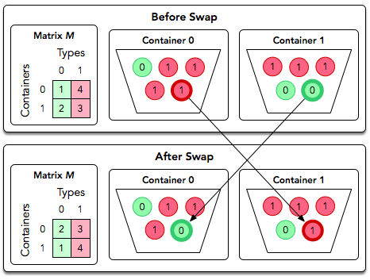
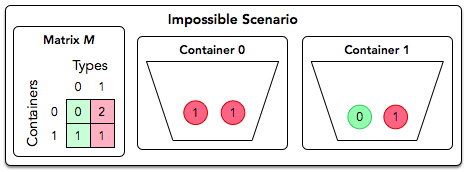

[Source](https://www.hackerrank.com/challenges/organizing-containers-of-balls/problem)
# Problem statement
David has several containers, each with a number of balls in it.  He has just enough containers to sort each type of ball he has into its own container.  David wants to sort the balls using his sort method.

As an example, David has  containers and  different types of balls, both of which are numbered from  to . The distribution of ball types per container are described by an  matrix of integers, . For example, consider the following diagram for :


In a single operation, David can swap two balls located in different containers.

The diagram below depicts a single swap operation:



David wants to perform some number of swap operations such that:


* Each container contains only balls of the same type.
* No two balls of the same type are located in different containers.

You must perform  queries where each query is in the form of a matrix, . For each query, print ```Possible``` on a new line if David can satisfy the conditions above for the given matrix.  Otherwise, print ```Impossible```.  


**Function Description**  

Complete the organizingContainers function in the editor below.  It should return a string, either ```Possible``` or ```Impossible```.  

organizingContainers has the following parameter(s):  


* containter: a two dimensional array of integers that represent the number of balls of each color in each container  


**Input Format**

The first line contains an integer , the number of queries.  

Each of the next  sets of lines is as follows:  


1. The first line contains an integer , the number of containers (rows) and ball types (columns).        
2. Each of the next  lines contains  space-separated integers describing row .

**Constraints**


*   
*   
* 


**Scoring**


* For  of score, .  
* For  of score, .


**Output Format**

For each query, print ```Possible``` on a new line if David can satisfy the conditions above for the given matrix.  Otherwise, print ```Impossible```.


**Sample Input 0**

```
2
2
1 1
1 1
2
0 2
1 1
```

**Sample Output 0**

```
Possible
Impossible
```

**Explanation 0**

We perform the following  queries:


1. The diagram below depicts one possible way to satisfy David's requirements for the first query:
 
Thus, we print ```Possible``` on a new line.
2. The diagram below depicts the matrix for the second query:
 
No matter how many times we swap balls of type  and  between the two containers, we'll never end up with one container only containing type  and the other container only containing type . Thus, we print ```Impossible``` on a new line.

**Sample Input 1**

```
2
3
1 3 1
2 1 2
3 3 3
3
0 2 1
1 1 1
2 0 0
```

**Sample Output 1**

```
Impossible
Possible
```
