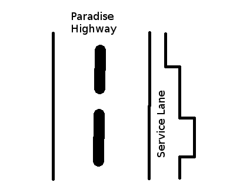

[Source](https://www.hackerrank.com/challenges/service-lane)
# Problem statement
Calvin is driving his favorite vehicle on the 101 freeway. He notices that the check engine light of his vehicle is on, and he wants to service it immediately to avoid any risks. Luckily, a service lane runs parallel to the highway. The service lane varies in width along its length.



You will be given an array of widths at points along the road (indices), then a list of the indices of entry and exit points. Considering each entry and exit point pair, calculate the maximum size vehicle that can travel that segment of the service lane safely.

For example, there are  measurements yielding .  If our entry index,  and our exit, , there are two segment widths of  and  respectively.  The widest vehicle that can fit through both is .  If  and , our widths are  which limits vehicle width to .  


**Function Description**

Complete the serviceLane function in the editor below.  It should return an array of integers representing the maximum width vehicle that can pass through each segment of the highway described.  

serviceLane has the following parameter(s):  


* n: an integer denoting the size of the  array
* cases: a two dimensional array of integers where each element is an array of two integers representing starting and ending indices for a segment to consider . 


**Input Format**


The first line of input contains two integers,  and , where  denotes the number of width measurements you will receive and  the number of test cases. The next line has  space-separated integers which represent the array .

The next  lines contain two integers,  and , where  is the start index and  is the end index of the segment being considered.


**Constraints**


* 
* 
* 
* 
* 


**Output Format**


For each test case, print the number that represents the largest vehicle type that can pass through the entire segment of the service lane between indexes  and  inclusive.


**Sample Input**


```
8 5
2 3 1 2 3 2 3 3
0 3
4 6
6 7
3 5
0 7
```


**Sample Output**


```
1
2
3
2
1
```


**Explanation**


Below is the representation of the lane:

```
   |HIGHWAY|Lane|    ->    Width

0: |       |--|            2
1: |       |---|           3
2: |       |-|             1
3: |       |--|            2
4: |       |---|           3
5: |       |--|            2
6: |       |---|           3
7: |       |---|           3
```

1. : From index  through  we have widths  and .  Nothing wider than  can pass all segments. 
2. : From index  through  we have widht  and .  Nothing wider than  can pass all segments.
3. :  .
4. : 
5. : .


