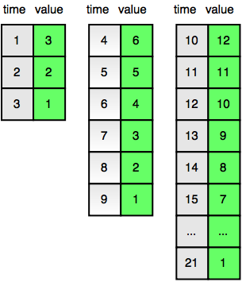

[Source](https://www.hackerrank.com/challenges/strange-code?h_r=profile)
# Problem statement
Bob has a strange counter. At the first second, it displays the number . Each second, the number displayed by the counter decrements by  until it reaches . 

The counter counts down in cycles. In next second, the timer resets to  and continues counting down. The diagram below shows the counter values for each time  in the first three cycles:



Find and print the value displayed by the counter at time .  


**Function Description**

Complete the strangeCounter function in the editor below.  It should return the integer value displayed by the counter at time .  

strangeCounter has the following parameter(s):  


* t: an integer  


**Input Format**


A single integer denoting the value of .


**Constraints**


* 


**Subtask**


*  for  of the maximum score.


**Output Format**


Print the value displayed by the strange counter at the given time .


**Sample Input**


```
4
```


**Sample Output**


```
6
```


**Explanation**


Time  marks the beginning of the second cycle.  It is double the number displayed at the beginning of the first cycle:. This is also shown in the diagram in the Problem Statement above.