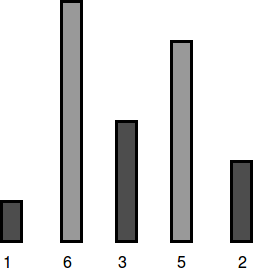
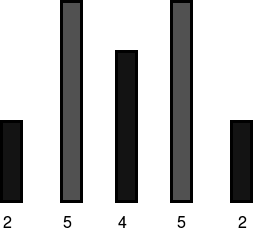

[Source](https://www.hackerrank.com/challenges/the-hurdle-race)
# Problem statement
Dan is playing a video game in which his character competes in a hurdle race.  Hurdles are of varying heights, and Dan has a maximum height he can jump.  There is a magic potion he can take that will increase his maximum height by  unit for each dose.  How many doses of the potion must he take to be able to jump all of the hurdles.

Given an array of hurdle heights , and an initial maximum height Dan can jump,  , determine the minimum number of doses Dan must take to be able to clear all the hurdles in the race.  

For example, if  and Dan can jump  unit high naturally, he must take  doses of potion to be able to jump all of the hurdles.  


**Function Description**  

Complete the hurdleRace function in the editor below.  It should return the minimum units of potion Dan needs to drink to jump all of the hurdles.  

hurdleRace has the following parameter(s):  


* k: an integer denoting the height Dan can jump naturally  
* height: an array of integers denoting the heights of each hurdle  

**Input Format**

The first line contains two space-separated integers  and , the number of hurdles and the maximum height Dan can jump naturally. 


The second line contains  space-separated integers  where .


**Constraints**


*   
*   

**Output Format**

Print an integer denoting the minimum doses of magic potion Dan must drink to complete the hurdle race.


**Sample Input 0**

```
5 4
1 6 3 5 2
```

**Sample Output 0**

```
2
```

**Explanation 0**

Dan's character can jump a maximum of  units, but the tallest hurdle has a height of :



To be able to jump all the hurdles, Dan must drink  doses.


**Sample Input 1**

```
5 7
2 5 4 5 2
```

**Sample Output 1**

```
0
```

**Explanation 1**

Dan's character can jump a maximum of  units, which is enough to cross all the hurdles:



Because he can already jump all the hurdles, Dan needs to drink  doses.

