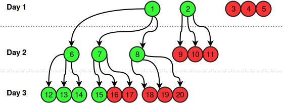

[Source](https://www.hackerrank.com/challenges/strange-advertising)
# Problem statement
HackerLand Enterprise is adopting a new viral advertising strategy. When they launch a new product, they advertise it to exactly  people on social media. 

On the first day, half of those  people (i.e., ) like the advertisement and each shares it with  of their friends. At the beginning of the second day,  people receive the advertisement. 

Each day,  of the recipients like the advertisement and will share it with  friends on the following day.  Assuming nobody receives the advertisement twice, determine how many people have liked the ad by the end of a given day, beginning with launch day as day .

For example, assume you want to know how many have liked the ad by the end of the  day.

```
Day
Shared
Liked
Cumulative
1
5
2
2
2
6
3
5
3
9
4
9
4
12
6
15
5
18
9
24
```
The cumulative number of likes is .  


**Function Description**  

Complete the viralAdvertising function in the editor below.  It should return the cumulative number of people who have liked the ad at a given time.  

viralAdvertising has the following parameter(s):  


* n: the integer number of days  

**Input Format**

A single integer, , denoting a number of days.


**Constraints**


* 

**Output Format**

Print the number of people who liked the advertisement during the first  days.


**Sample Input**

```
3
```

**Sample Output**

```
9
```

**Explanation**

This example is depicted in the following diagram:  



 people liked the advertisement on the first day,  people liked the advertisement on the second day and  people liked the advertisement on the third day, so the answer is .

