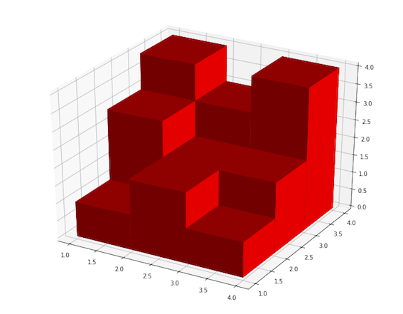

[Source](https://www.hackerrank.com/challenges/3d-surface-area)
# Problem statement
Madison, is a little girl who is fond of toys. Her friend Mason works in a toy manufacturing factory . Mason has a 2D board  of size  with  rows and  columns. The board is divided into cells of size  with each cell indicated by it's coordinate . The cell   has an integer  written on it. To create the toy Mason stacks  number of cubes of size  on the cell . 

Given the description of the board showing the values of  and that the price of the toy is equal to the 3d surface area find the price of the toy. 




**Input Format**


The first line contains two space-separated integers  and  the height and the width of the board respectively.

The next   lines contains  space separated integers. The  integer in  line denotes .


**Constraints**


* 
* 


**Output Format**


Print the required answer, i.e the price of the toy, in one line.


**Sample Input 0**


```
1 1
1
```


**Sample Output 0**


```
6
```


**Explanation 0**


The surface area of  cube is 6.


**Sample Input 1**


```
3 3
1 3 4
2 2 3
1 2 4
```


**Sample Output 1**


```
60
```


**Explanation 1**


The sample input corresponds to the figure described in problem statement.