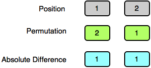
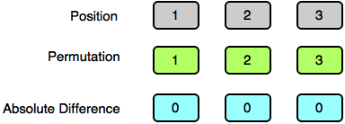

[Source](https://www.hackerrank.com/challenges/absolute-permutation/problem)
# Problem statement
We define  to be a permutation of the first  natural numbers in the range . Let  denote the value at position  in permutation  using -based indexing. 

 is considered to be an absolute permutation if   holds true for every .

Given  and , print the lexicographically smallest absolute permutation .  If no absolute permutation exists, print ```-1```.

For example, let  giving us an array .  If we use  based indexing, create a permutation where every .  If , we could rearrange them to :  

```
pos[i]  i      |Difference|
3       1       2
4       2       2
1       3       2
2       4       2
```


**Function Description**

Complete the absolutePermutation function in the editor below.  It should return an integer that represents the smallest lexicographically smallest permutation, or  if there is none.  

absolutePermutation has the following parameter(s):  


* n: the upper bound of natural numbers to consider, inclusive  
* k: the integer difference between each element and its index


**Input Format**


The first line contains an integer , the number of test cases. 


Each of the next  lines contains  space-separated integers,  and .  


**Constraints**


* 
* 
* 


**Output Format**


On a new line for each test case, print the lexicographically smallest absolute permutation.  If no absolute permutation exists, print ```-1```.


**Sample Input**


```
3
2 1
3 0
3 2
```


**Sample Output**


```
2 1
1 2 3
-1
```


**Explanation**


Test Case 0:



Test Case 1:



Test Case 2:


No absolute permutation exists, so we print ```-1``` on a new line.