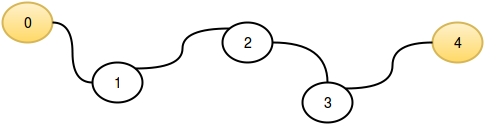

[Source](https://www.hackerrank.com/challenges/flatland-space-stations)
# Problem statement
Flatland is a country with a number of cities, some of which have space stations.  Cities are numbered consecutively and each has a road of  length connecting it to the next city.  It is not a circular route, so the first city doesn't connect with the last city.  Determine the maximum distance from any city to it's nearest space station.

For example, there are  cities and  of them has a space station, city .  They occur consecutively along a route.  City  is  unit away and city  is  units away.  City  is  units from its nearest space station as one is located there.  The maximum distance is .


**Function Description**

Complete the flatlandSpaceStations function in the editor below.  It should return an integer that represents the maximum distance any city is from a space station.  

flatlandSpaceStations has the following parameter(s):  


* n: the number of cities  
* c: an integer array that contains the indices of cities with a space station, -based indexing  


**Input Format**


The first line consists of two space-separated integers,  and . 


The second line contains  space-separated integers, the indices of each city having a space-station. These values are unordered and unique.


**Constraints**


* 
* 
* There will be at least  city with a space station.
* No city has more than one space station.


**Output Format**


Print an integer denoting the maximum distance that an astronaut in a Flatland city would need to travel to reach the nearest space station.


**Sample Input 0**

```
5 2
0 4
```

**Sample Output 0**

```
2
```

**Explanation 0**

This sample corresponds to following graphic:  



The distance to the nearest space station for each city is listed below:


*  has distance , as it contains a space station.
*  has distance  to the space station in .
*  has distance  to the space stations in  and .
*  has distance  to the space station in .
*  has distance , as it contains a space station.

We then take .


**Sample Input 1**

```
6 6
0 1 2 4 3 5
```

**Sample Output 1**

```
0
```

**Explanation 1**

In this sample,  so every city has space station and we print  as our answer.


