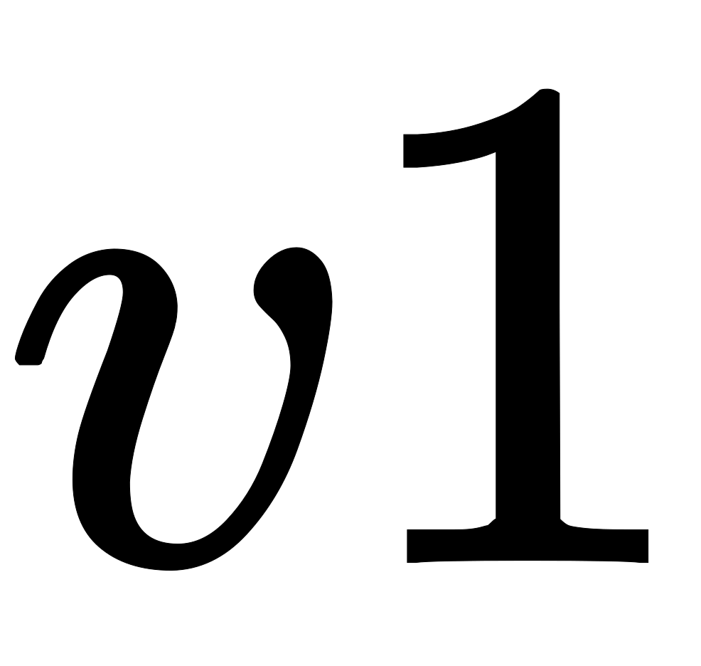
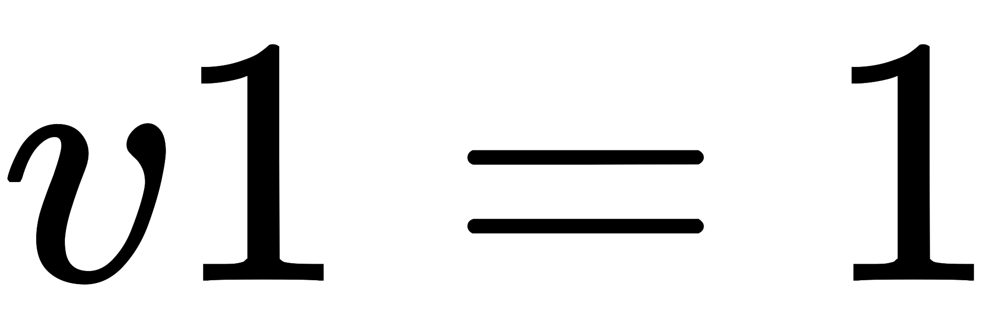
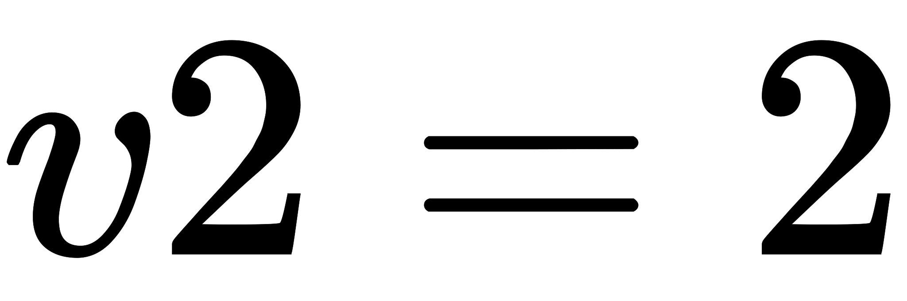
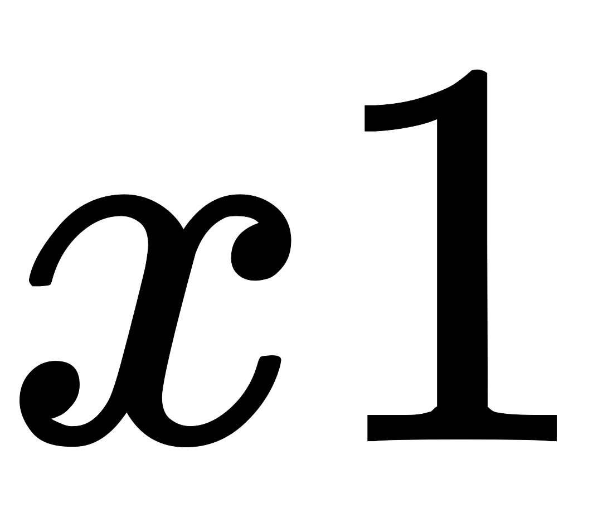
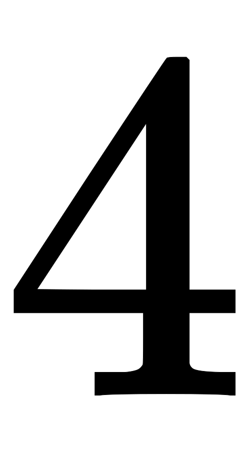
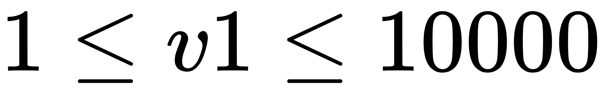
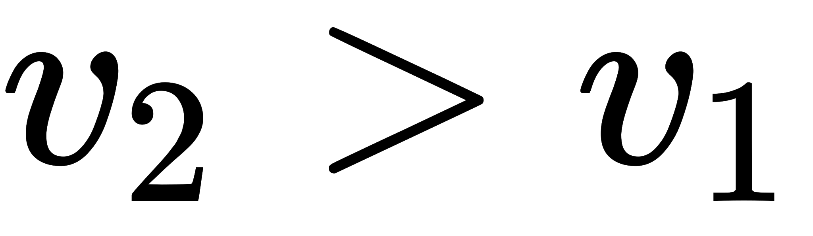

[Source](https://www.hackerrank.com/challenges/kangaroo)
# Problem statement
You are choreographing a circus show with various animals. For one act, you are given two kangaroos on a number line ready to jump in the positive direction (i.e, toward positive infinity). 


* The first kangaroo starts at location  and moves at a rate of  meters per jump. 
* The second kangaroo starts at location  and moves at a rate of  meters per jump.
You have to figure out a way to get both kangaroos at the same location at the same time as part of the show.  If it is possible, return ```YES```, otherwise return ```NO```.

For example, kangaroo  starts at  with a jump distance  and kangaroo  starts at  with a jump distance of . After one jump, they are both at , (, ), so our answer is ```YES```.


**Function Description**

Complete the function kangaroo in the editor below.  It should return ```YES``` if they reach the same position at the same time, or ```NO``` if they don't.  

kangaroo has the following parameter(s):  


* x1, v1: integers, starting position and jump distance for kangaroo 1
* x2, v2: integers, starting position and jump distance for kangaroo 2

**Input Format**

A single line of four space-separated integers denoting the respective values of , , , and .


**Constraints**


*   
*   
*   

**Output Format**

Print ```YES``` if they can land on the same location at the same time; otherwise, print ```NO```.


**Note:** The two kangaroos must land at the same location after making the same number of jumps.


**Sample Input 0**

```
0 3 4 2
```

**Sample Output 0**

```
YES
```

**Explanation 0**

The two kangaroos jump through the following sequence of locations:


From the image, it is clear that the kangaroos meet at the same location (number  on the number line) after same number of jumps ( jumps), and we print ```YES```.


**Sample Input 1**

```
0 2 5 3
```

**Sample Output 1**

```
NO
```

**Explanation 1**

The second kangaroo has a starting location that is ahead (further to the right) of the first kangaroo's starting location (i.e., ). Because the second kangaroo moves at a faster rate (meaning ) and is already ahead of the first kangaroo, the first kangaroo will never be able to catch up. Thus, we print NO. 

