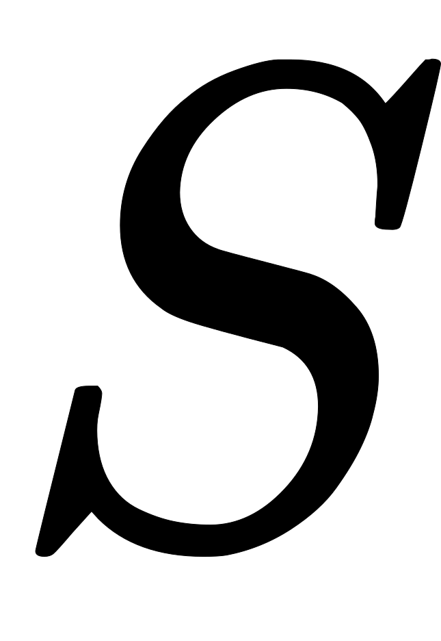
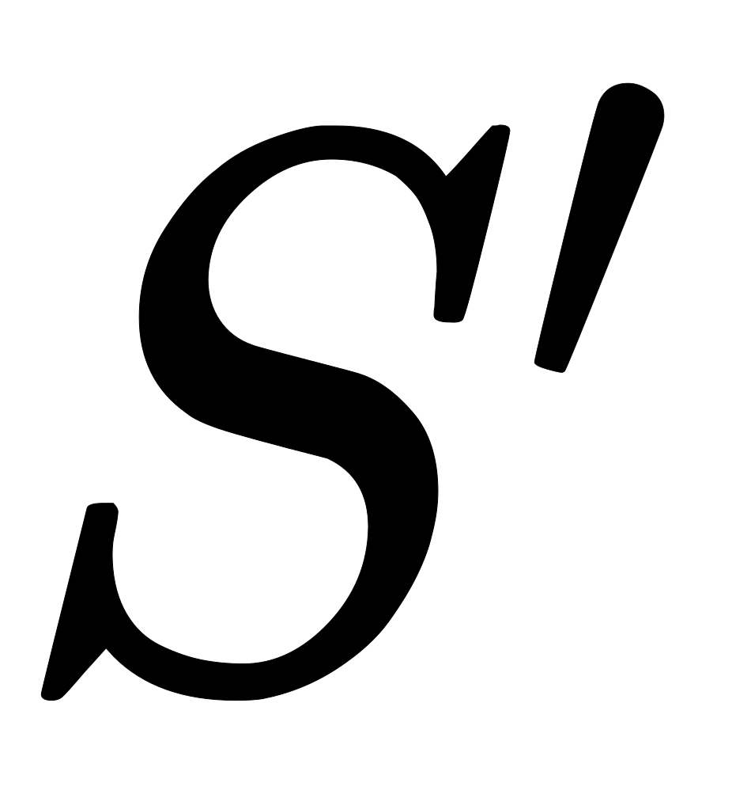
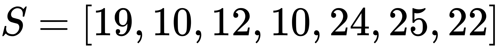
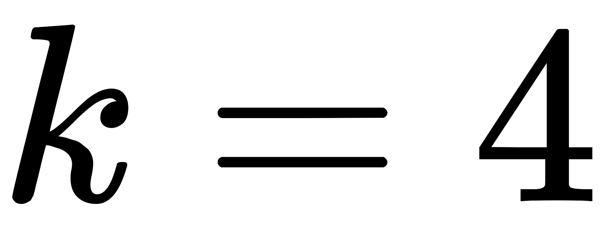
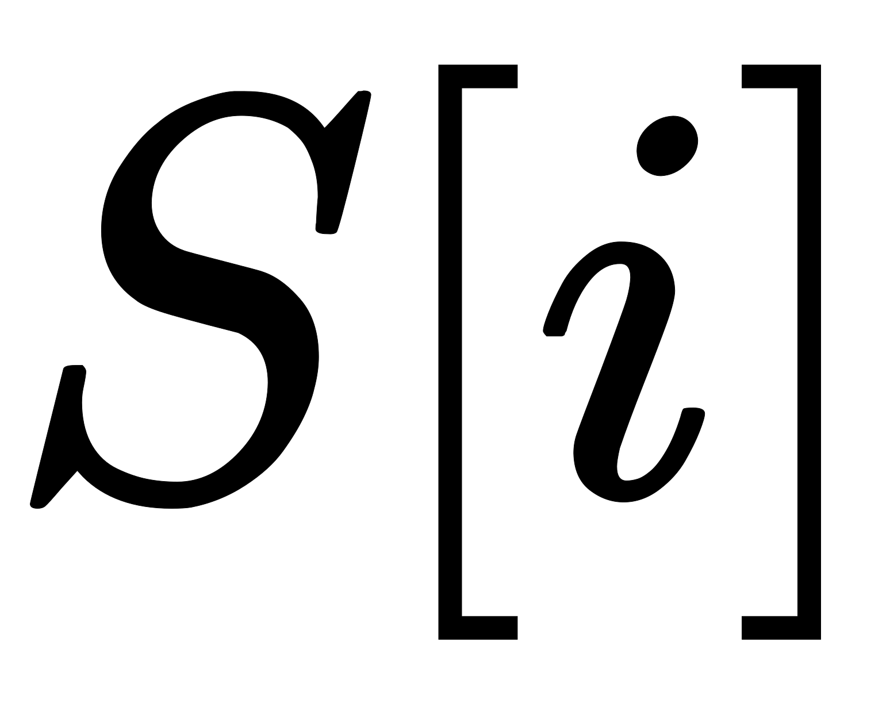
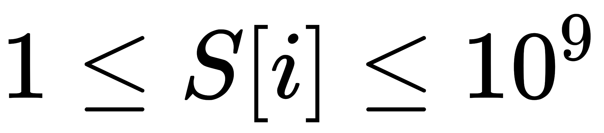
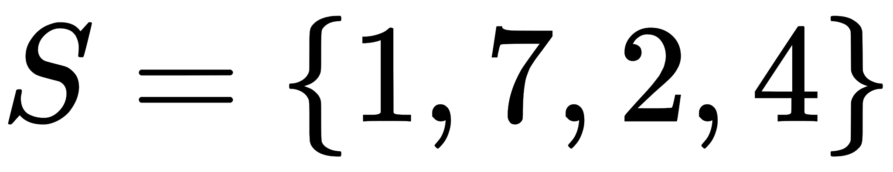
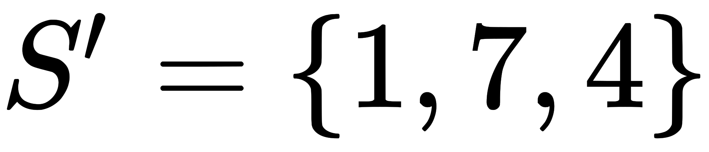
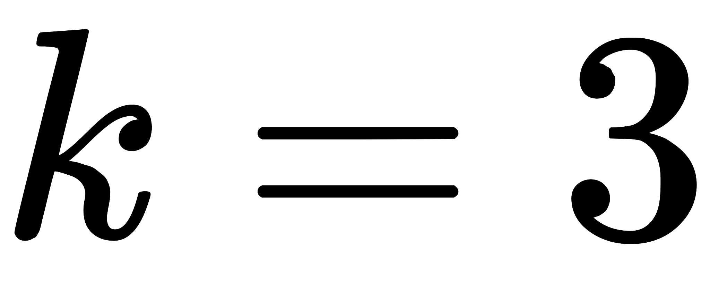

[Source](https://www.hackerrank.com/challenges/non-divisible-subset/problem)
# Problem statement
Given a set of distinct integers, print the size of a maximal subset of  where the sum of any  numbers in  is not evenly divisible by .

For example, the array  and .  One of the arrays that can be created is .  Another is .  After testing all permutations, the maximum length solution array has  elements.  


**Function Description**  

Complete the nonDivisibleSubset function in the editor below.  It should return an integer representing the length of the longest subset of  meeting the criteria.  

nonDivisibleSubset has the following parameter(s):  


* S: an array of integers  
* k: an integer  

**Input Format**

The first line contains  space-separated integers,  and , the number of values in  and the non factor. 


The second line contains  space-separated integers describing , the unique values of the set.


**Constraints**


* 
* 
* 
* All of the given numbers are distinct.

**Output Format**

Print the size of the largest possible subset ().


**Sample Input**

```
4 3
1 7 2 4
```

**Sample Output**

```
3
```

**Explanation**

The sums of all permutations of two elements from  are:

```
1 + 7 = 8
1 + 2 = 3
1 + 4 = 5
7 + 2 = 9
7 + 4 = 11
2 + 4 = 6
```
We see that only  will not ever sum to a multiple of .

