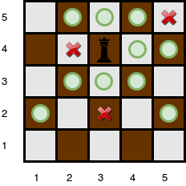

[Source](https://www.hackerrank.com/challenges/queens-attack-2/problem)
# Problem statement
You will be given a square chess board with one queen and a number of obstacles placed on it.  Determine how many squares the queen can attack.  

A [queen](https://en.wikipedia.org/wiki/Queen_%28chess%29) is standing on an  [chessboard](https://en.wikipedia.org/wiki/Chess). The chess board's rows are numbered from  to , going from bottom to top.  Its columns are numbered from  to , going from left to right. Each square is referenced by a tuple, , describing the row, , and column, , where the square is located.

The queen is standing at position .  In a single move, she can attack any square in any of the eight directions (left, right, up, down, and the four diagonals). In the diagram below, the green circles denote all the cells the queen can attack from : 


There are obstacles on the chessboard, each preventing the queen from attacking any square beyond it on that path. For example, an obstacle at location  in the diagram above prevents the queen from attacking cells , , and :


Given the queen's position and the locations of all the obstacles, find and print the number of squares the queen can attack from her position at .  In the board above, there are  such squares.


**Function Description**  

Complete the queensAttack function in the editor below.  It should return an integer that describes the number of squares the queen can attack.  

queensAttack has the following parameters: 


- n: an integer, the number of rows and columns in the board 


- k: an integer, the number of obstacles on the board 


- r_q: integer, the row number of the queen's position 


- c_q: integer, the column number of the queen's position 


- obstacles: a two dimensional array of integers where each element is an array of  integers, the row and column of an obstacle  


**Input Format**

The first line contains two space-separated integers  and , the length of the board's sides and the number of obstacles. 


The next line contains two space-separated integers  and , the queen's row and column position. 


Each of the next  lines contains two space-separated integers  and , the row and column position of .       


**Constraints**


* 
* 
* A single cell may contain more than one obstacle.
* There will never be an obstacle at the position where the queen is located.


**Subtasks**

For  of the maximum score: 


* 
* 

For  of the maximum score: 


* 
* 


**Output Format**

Print the number of squares that the queen can attack from position .


**Sample Input 0**

```
4 0
4 4
```

**Sample Output 0**

```
9
```

**Explanation 0**

The queen is standing at position  on a  chessboard with no obstacles:


**Sample Input 1**

```
5 3
4 3
5 5
4 2
2 3
```

**Sample Output 1**

```
10
```

**Explanation 1**

The queen is standing at position  on a  chessboard with  obstacles:



The number of squares she can attack from that position is .


**Sample Input 2**

```
1 0
1 1
```

**Sample Output 2**

```
0
```

**Explanation 2**

Since there is only one square, and the queen is on it, the queen can move 0 squares.

