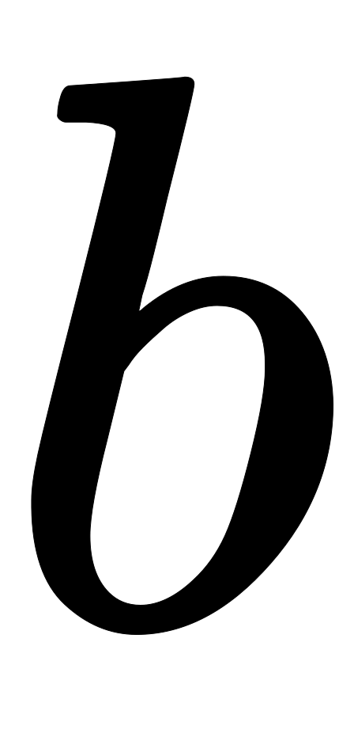
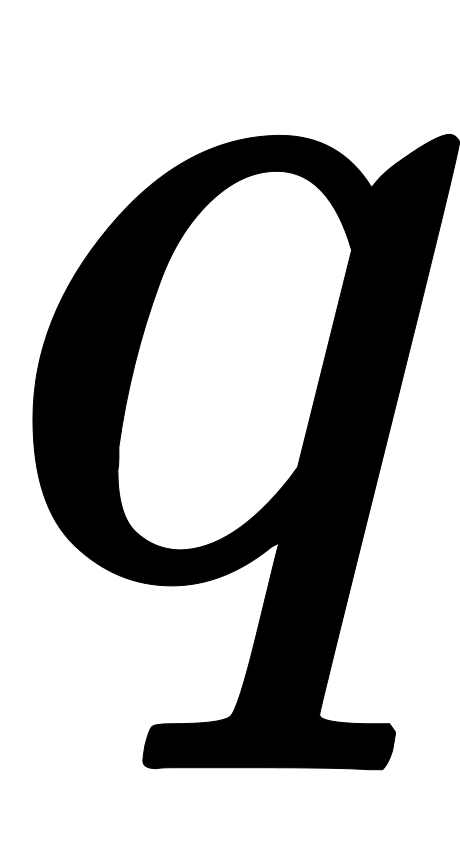

[Source](https://www.hackerrank.com/challenges/sherlock-and-squares)
# Problem statement
Watson likes to challenge Sherlock's math ability.  He will provide a starting and ending value describing a range of integers.  Sherlock must determine the number of square integers within that range, inclusive of the endpoints.


**Note**: A square integer is an integer which is the square of an integer, e.g. . 

For example, the range is  and , inclusive.  There are three square integers in the range:  and .  


**Function Description**

Complete the squares function in the editor below.  It should return an integer representing the number of square integers in the inclusive range from  to .  

squares has the following parameter(s):  


* a: an integer, the lower range boundary
* b: an integer, the uppere range boundary 

**Input Format**

The first line contains , the number of test cases. 


Each of the next  lines contains two space-separated integers denoting  and , the starting and ending integers in the ranges.     


**Constraints**

 


  


**Output Format**

For each test case, print the number of square integers in the range on a new line.  


**Sample Input**

```
2
3 9
17 24
```

**Sample Output**

```
2
0
```

**Explanation**

Test Case #00: In range ,  and  are the two square integers. 


Test Case #01: In range , there are no square integers.  

